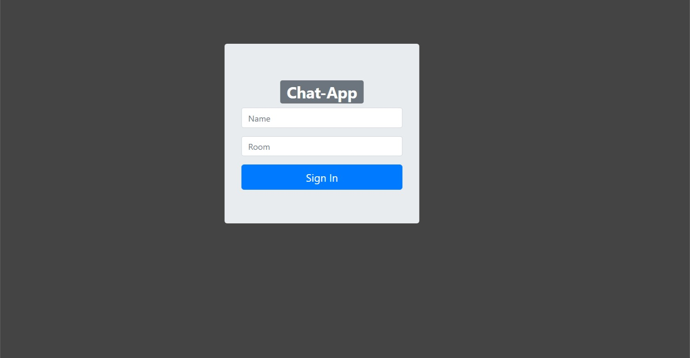
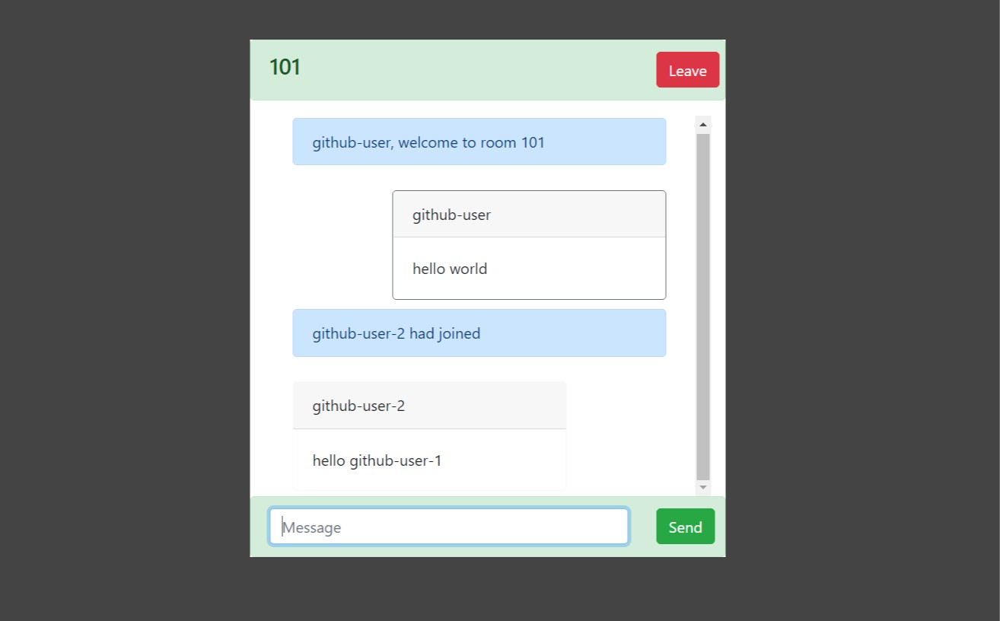

# React-Chat-App

React-Chat-App is a chat application built with React and Node.js using the socket.io library. It allows users to engage in real-time conversations through socket connections. The application does not rely on any specific database or authentication system, making it highly flexible and adaptable.

## Quick Sneak Peek of the Application UI

### Landing Page


### Chat Preview


## How to Run the Application on Your System

To run the React-Chat-App on your system, follow these steps:

1. Clone the forked repository:

   ```shell
   git clone [forked_repo_url]
   ```

2. Navigate to the cloned project directory:

   ```shell
   cd REACT-CHAT-APP
   ```

3. Start the server:

   ```shell
   cd server
   npm install
   npm start
   ```

   This will start the Express server.

4. Open another terminal or command prompt and navigate to the client directory:

   ```shell
   cd client
   npm install
   npm start
   ```

   This will start the React server.

5. Access the React-Chat-App by visiting `http://localhost:3000` in your web browser.

Please note that you need to have Node.js installed on your system to run the application.

Feel free to explore and modify the React-Chat-App to suit your needs. Enjoy real-time chat functionality with socket.io!

